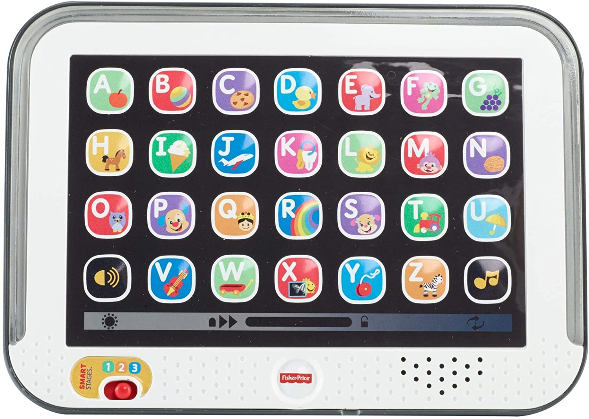
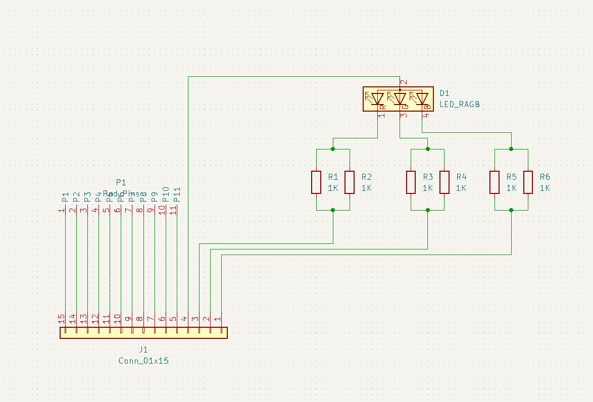
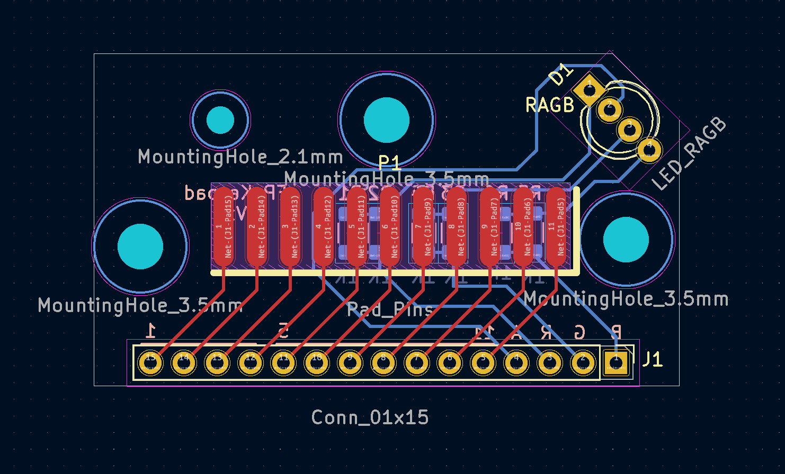

# Fisher Price Keypad

Turning a Fisher Price Smart Stages keypad into a HID Keyboard.

## Wut?

I really wanted to turn a Fisher Price tablet into a keyboard that works over USB for the kicks and giggles.

This turned into a multi-part project where I learned PCB design (with KiCad) as a drop-in replacement to the factory board in the tablet.

The software is made with the Arduino framework to make things easy. The `Keyboard.h` header makes it simple to turn a microcontroller into a HID Keyboard.

## Hardware

* Fisher Price "Smart Stages" Tablet
* Custom PCBs (to replace tablet's PCB)
* Adafruit ItsyBitsy (or any Arduino that can use `Keyboard.h`)

## Custom PCB

I created a custom PCB to replace the board that comes with the tablet. This custom board allows pins or connectors to be soldered so the keypad can be used with an Arduino.

The PCB can be printed with the gerbers in [the gerber zip](fp_tablet_keypad_v1_gerbers.zip). I printed my boards through [OSHPark](https://oshpark.com/). It cost about $9.00 (USD) to print 3 boards.

